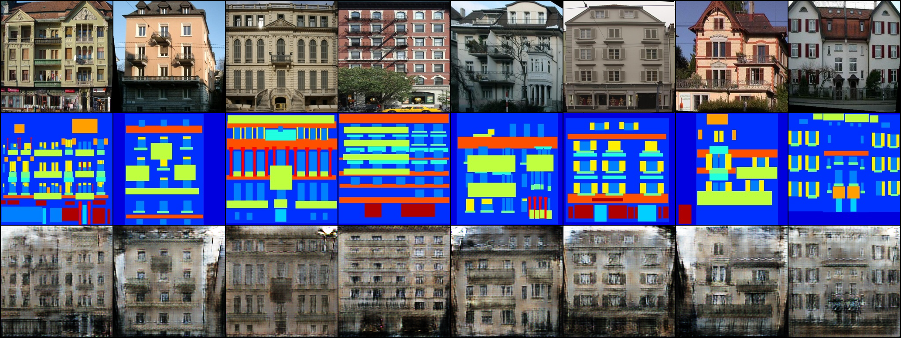
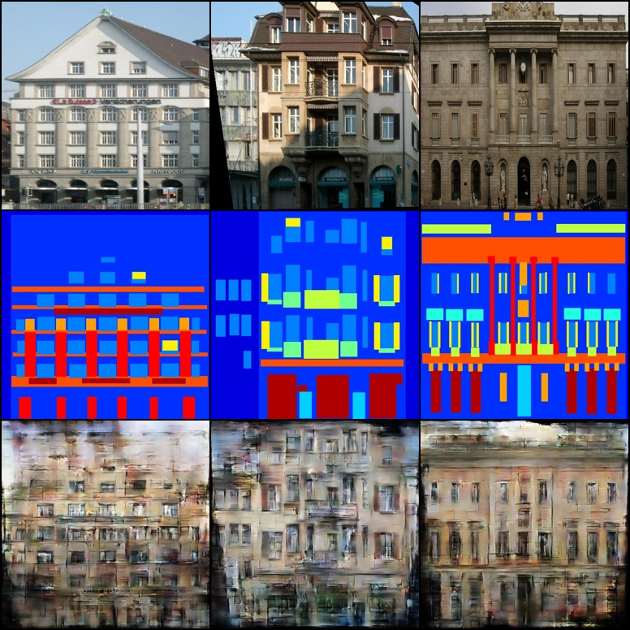
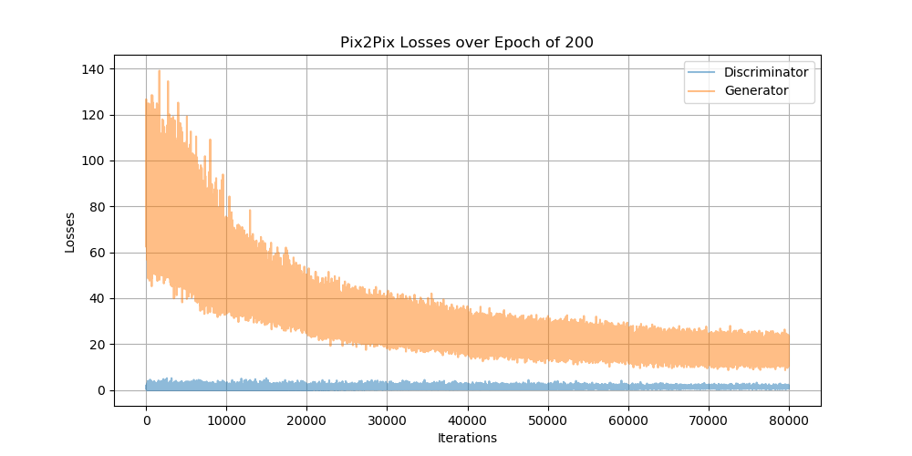

## Pix2Pix : [Image-to-Image Translation with Conditional Adversarial Networks](https://arxiv.org/abs/1611.07004)

### 0. Inference Result (After 200 Epochs)


### 1. Run the Codes
#### 1) Download Datasets
```
sh download_dataset.sh facades
```
#### 2) Directory
Check the directory corresponds to the following.
```
+---[data]
|   \---[facades]
|       \----[test]
|               +---[]
|               |...
|               +---[]
|       \---[train]
|               +---[]
|               ...
|               +---[]
|       \---[val]
|               +---[]
|               ...
|               +---[]
+---config.py
+---download_dataset.sh
|   ...
+---utils.py
```
#### 3) Train
```
python train.py
```
#### 4) Inference
```
python inference.py
```

### 2. Sample Generated During Training


### 3. Loss Plots

