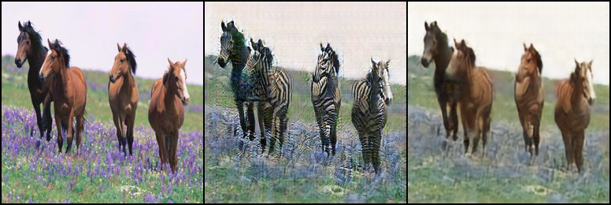
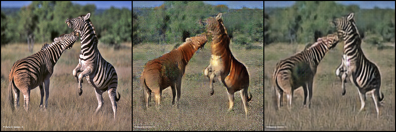
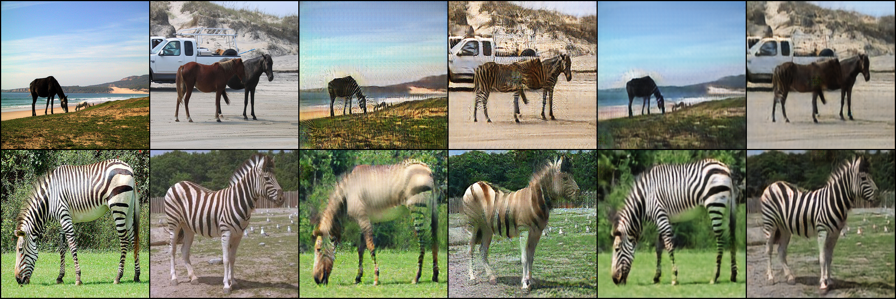
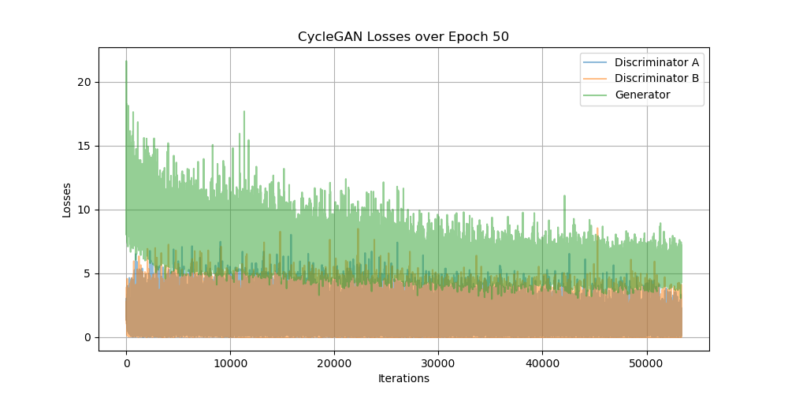

## CycleGAN : [Image-to-Image Translation with Conditional Adversarial Networks](https://arxiv.org/abs/1611.07004)

### 0. Inference Result (After 70 Epochs)
#### 1) Horse | Generated Zebra | Reconstructed Horse 


#### 2) Zebra | Generated Horse | Reconstructed Zebra 


### 1. Run the Codes
#### 1) Download Datasets
```
sh download_dataset.sh horse2zebra
```
#### 2) Directory
Check if the directory corresponds to the following:
```
+---[data]
|   \---[horse2zebra]
|       \----[testA]
|               +---[n02381460_20.jpg]
|               |...
|               +---[n02381460_9260.jpg]
|       \----[testB]
|               +---[n02391049_80.jpg]
|               |...
|               +---[n02391049_10980.jpg]
|       \---[trainA]
|               +---[n02381460_2.jpg]
|               ...
|               +---[n02381460_9263.jpg]
|       \---[trainB]
|               +---[n02391049_2.jpg]
|               ...
|               +---[n02391049_11195.jpg]
+---config.py
+---download_dataset.sh
|   ...
+---utils.py
```
#### 3) Train
```
python train.py
```
#### 4) Inference
```
python inference.py
```

### 2. Sample Generated During Training
Two Real Images | Two Generated Images | Two Reconstructed Images 


### 3. Loss During Train Process

