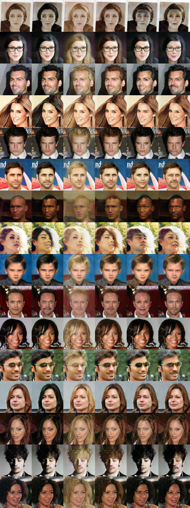
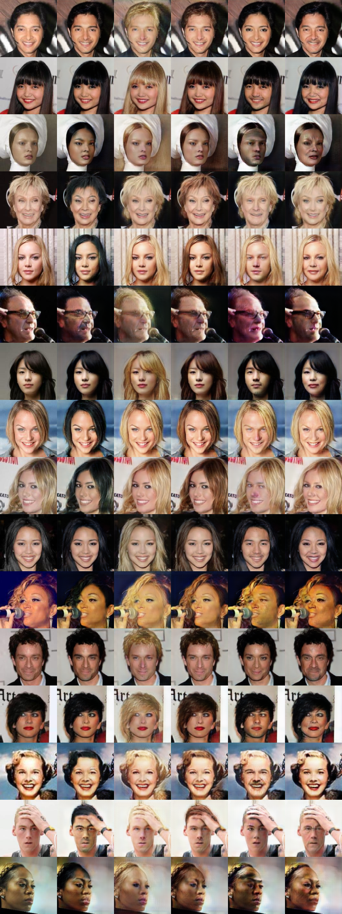
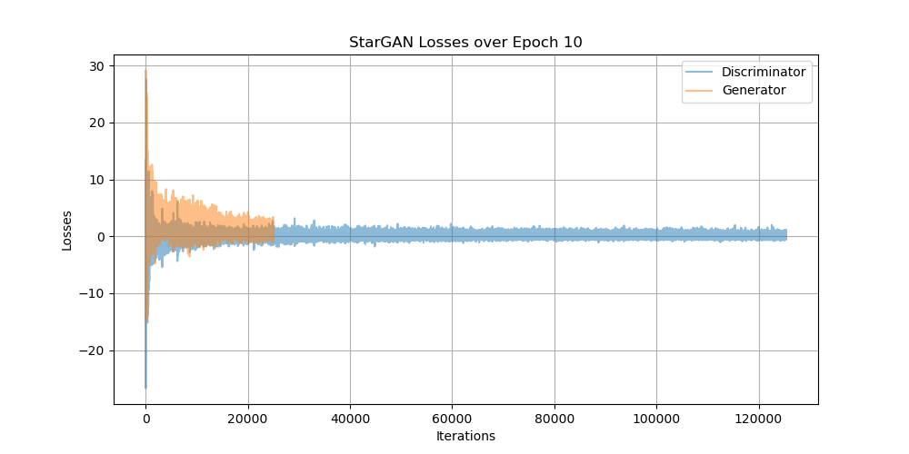

## StarGAN : [StarGAN: Unified Generative Adversarial Networks for Multi-Domain Image-to-Image Translation](https://arxiv.org/abs/1711.09020)

### 0. Inference Result (After 10 Epoch)


### 1. Run the Codes
#### 1) Download Datasets
```
sh download_dataset.sh
```
#### 2) Directory
Check if the directory corresponds to the following:
```
+---[data]
|   \---[celeba]
|       \----[images]
|               +---[000001.jpg]
|               |...
|               +---[202599.jpg]
|       +---[list_attr_celeba.txt]
+---config.py
+---download_dataset.sh
|   ...
+---utils.py
```
#### 3) Train
```
python train.py
```
#### 4) Inference
```
python inference.py
```

### 2. Sample Generated During Training


### 3. Loss During Train Process

