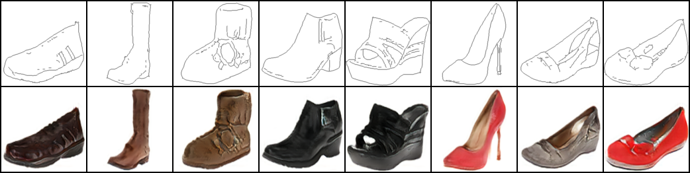
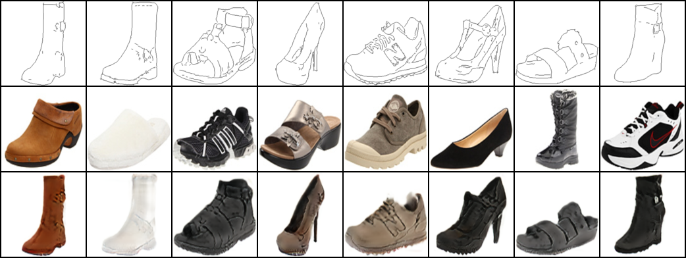
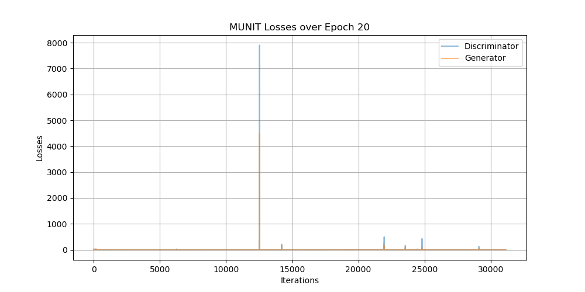

## MUNIT : [Multimodal Unsupervised Image-to-Image Translation](https://arxiv.org/abs/1804.04732)

### 0. Inference Result (After 20 Epochs)
#### 1) Random Image Translation


#### 2) Example Guided Image Translation


### 1. Run the Codes
#### 1) Download Datasets
```
sh download_dataset.sh edges2shoes
```
#### 2) Split the Datasets
```
sh split_dataset.sh
```
#### 3) Directory
Check if the directory corresponds to the following:
```
+---[data]
|   \---[edges2shoes]
|       \----[train]
|               +---[1_AB.jpg]
|               |...
|               +---[49825_AB.jpg]
|       \---[val]
|               +---[1_AB.jpg]
|               ...
|               +---[200_AB.jpg]
+---config.py
+---download_dataset.sh
|   ...
+---utils.py
```
#### 3) Train
```
python train.py
```
#### 4) Inference
##### a) Random Image Translation
```
python inference.py
```
##### b) Example Guided Image Translation
```
python inference.py --style 'Ex_Guided'
```

### 2. Sample Generated During Training (Random Generation)


### 3. Loss During Train Process

