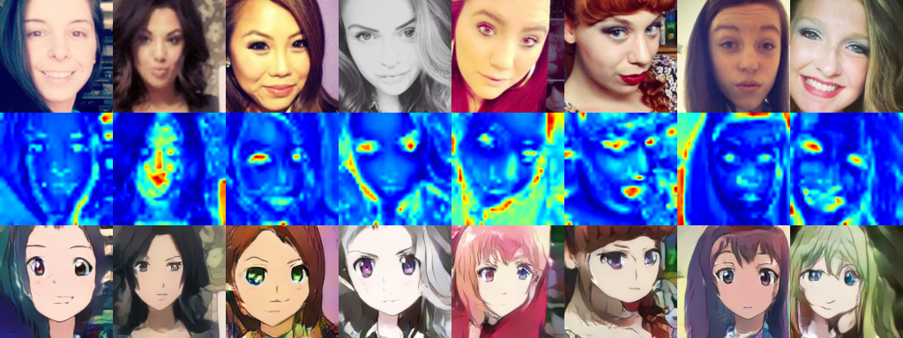
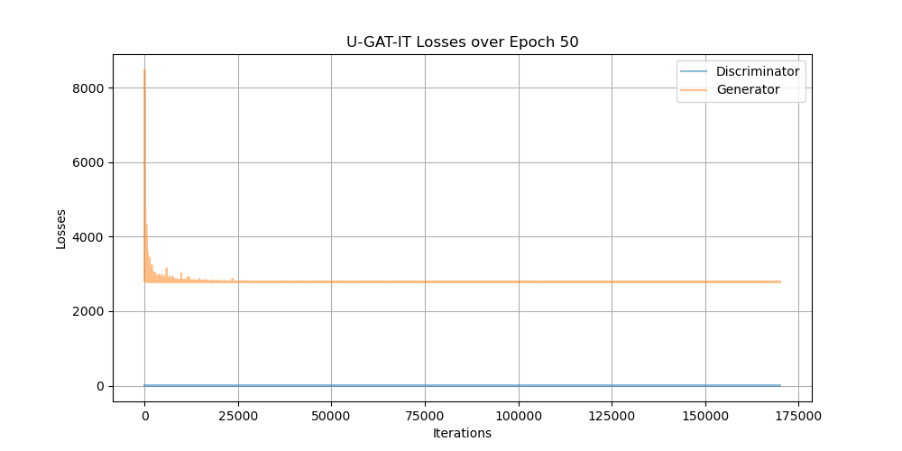

## U-GAT-IT : [U-GAT-IT: Unsupervised Generative Attentional Networks with Adaptive Layer-Instance Normalization for Image-to-Image Translation](https://arxiv.org/abs/1611.07004)

### 0. Inference Result (After 50 Epochs)
#### 1) Selfie -> Anime


### 1. Run the Codes
#### 1) Download Datasets
You can download the `selfie2anime` dataset from [here](https://drive.google.com/file/d/1xOWj1UVgp6NKMT3HbPhBbtq2A4EDkghF/view).

#### 2) Directory
Check if the directory corresponds to the following:
```
+---[selfie2anime]
|   \----[testA]
|          +---[female_281.jpg]
|          |...
|          +---[female_33548.jpg]
|   \----[testB]
|          +---[0000.jpg]
|          |...
|          +---[0099.jpg]
|   \---[trainA]
|          +---[female_10.jpg]
|          |...
|          +---[female_33638.jpg]
|   \---[trainB]
|          +---[0000.jpg]
|          |...
|          +---[3399.jpg]
+---config.py
+---inference.py
|   ...
+---utils.py
```
#### 3) Train
```
python train.py
```
#### 4) Inference
```
python inference.py
```

### 2. Sample Generated During Training
Selfie | GradCAM | Anime



### 3. Loss During Train Process

