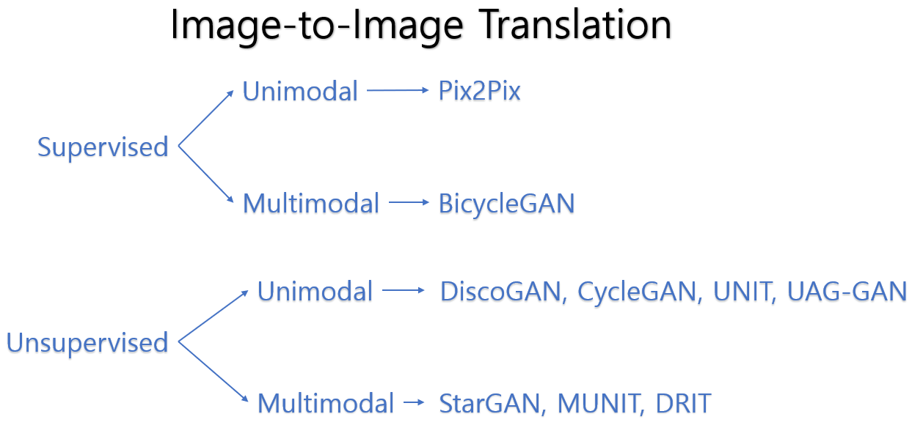

# Implementations of Image to Image Translation via Generative Models using PyTorch

### 0. Introduction
This repository contains implementations of fundamental Image-to-Image Translation via Generative Models, including Pix2Pix, DiscoGAN, CycleGAN, BicycleGAN, and StarGAN, Unsupervised Attention-Guided GAN, and MUNIT. </br>
<br> Please note that I focused on implementation rather than deriving the best results. In other words, a set of hyper-parameters that I used may not produce the best results. For example, you can expect better CycleGAN results when increasing total epochs to 200.



### 1. [Pix2Pix : Image-to-Image Translation with Conditional Adversarial Networks](https://github.com/hee9joon/Image-to-Image-Translation/tree/master/1.%20Pix2Pix)


### 2. [DiscoGAN : Learning to Discover Cross-Domain Relations with Generative Adversarial Networks](https://github.com/hee9joon/Image-to-Image-Translation/tree/master/2.%20DiscoGAN)


### 3. [CycleGAN : Image-to-Image Translation with Conditional Adversarial Networks](https://github.com/hee9joon/Image-to-Image-Translation/tree/master/3.%20CycleGAN)


### 4. [BicycleGAN : Toward Multimodal Image-to-Image Translation](https://github.com/hee9joon/Image-to-Image-Translation/tree/master/4.%20BicycleGAN)


### 5. [StarGAN : Unified Generative Adversarial Networks for Multi-Domain Image-to-Image Translation](https://github.com/hee9joon/Image-to-Image-Translation/tree/master/5.%20StarGAN)


### 6. [Unsupervised Attention-Guided GAN : Unsupervised Attention-guided Image to Image Translation](https://github.com/hee9joon/Image-to-Image-Translation/tree/master/6.%20Unsupervised%20Attention-Guided%20GAN)


### 7. [MUNIT : Multimodal Unsupervised Image-to-Image Translation](https://github.com/hee9joon/Image-to-Image-Translation/tree/master/7.%20MUNIT)


### 8. [U-GAT-IT: Unsupervised Generative Attentional Networks with Adaptive Layer-Instance Normalization for Image-to-Image Translation](https://arxiv.org/abs/1611.07004)


### Development Environment
```
- Ubuntu 18.04 LTS
- NVIDIA GFORCE GTX 1080 ti
- CUDA 10.2
- torch 1.5.1
- torchvision 0.5.0
- etc
```
