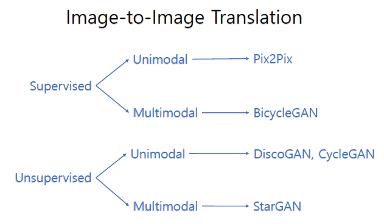

# Implementations of Image to Image Translation via Generative Models using PyTorch

### 0. Introduction
This repository contains implementations of fundamental Image-to-Image Translation via Generative Models, including Pix2Pix, DiscoGAN, CycleGAN, BicycleGAN, and StarGAN.  
  Please note that I focused on implementation rather than deriving the best results. In other words, a set of hyper-parameters that I used may not produce the best results. For example, you can expect better CycleGAN results when increasing total epochs to 200.

### 1. [Pix2Pix Repository](https://github.com/hee9joon/Image-to-Image-Translation/tree/master/1.%20Pix2Pix)

### 2. [DiscoGAN Repository](https://github.com/hee9joon/Image-to-Image-Translation/tree/master/2.%20DiscoGAN)

### 3. [CycleGAN Repository](https://github.com/hee9joon/Image-to-Image-Translation/tree/master/3.%20CycleGAN)

### 4. [BicycleGAN Repository](https://github.com/hee9joon/Image-to-Image-Translation/tree/master/4.%20BicycleGAN)

### 5. [StarGAN Repository](https://github.com/hee9joon/Image-to-Image-Translation/tree/master/5.%20StarGAN)

### 6. Development Environment
- Ubuntu 18.04 LTS
- NVIDIA GFORCE GTX 1080 ti
- CUDA 10.2
- torch 1.5.1
- torchvision 0.5.0
- etc
